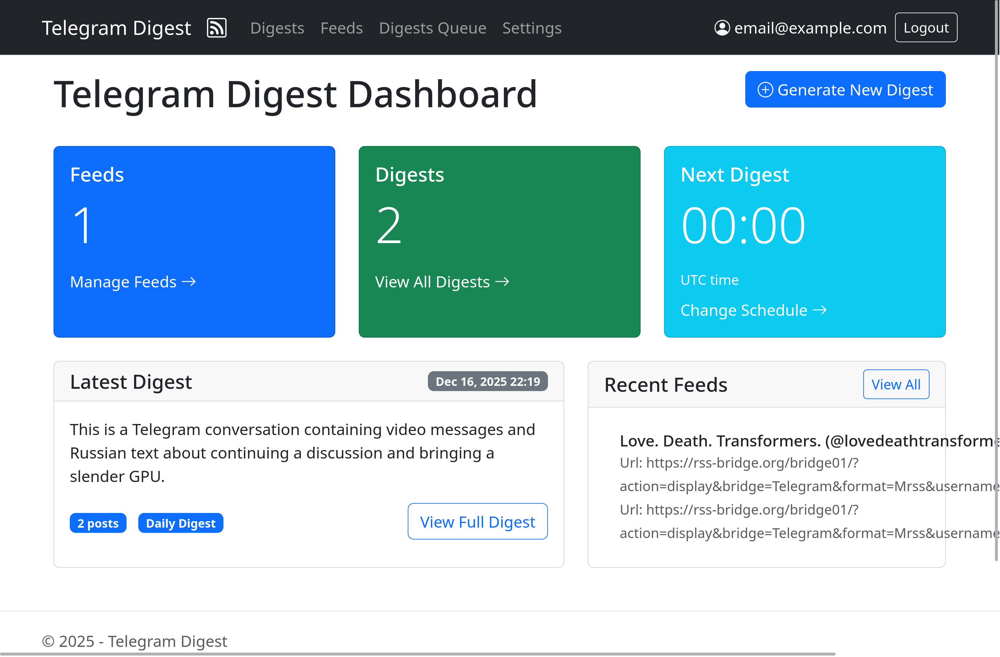
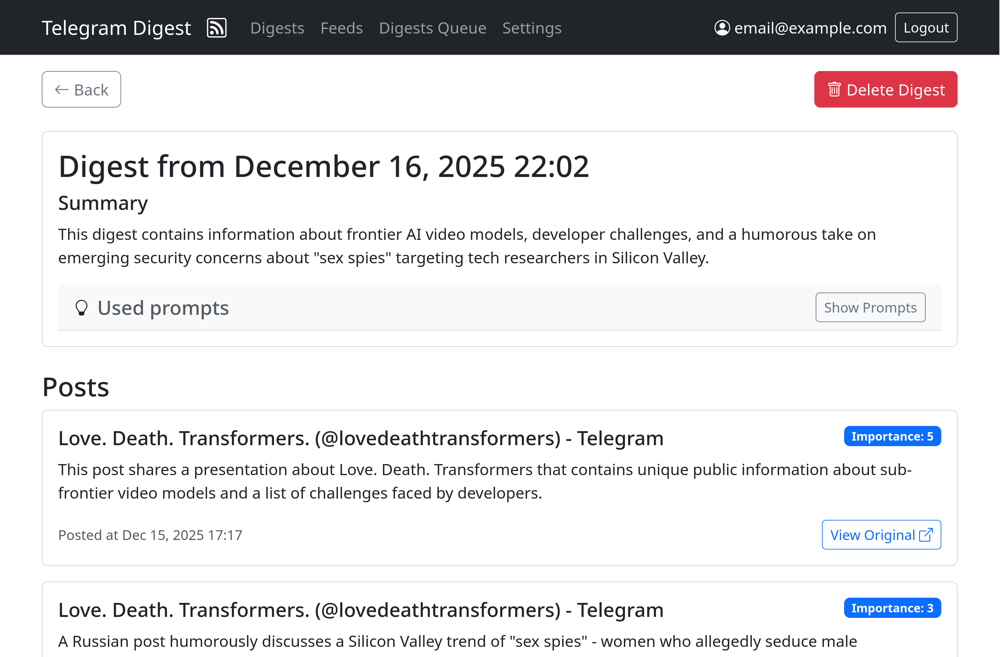
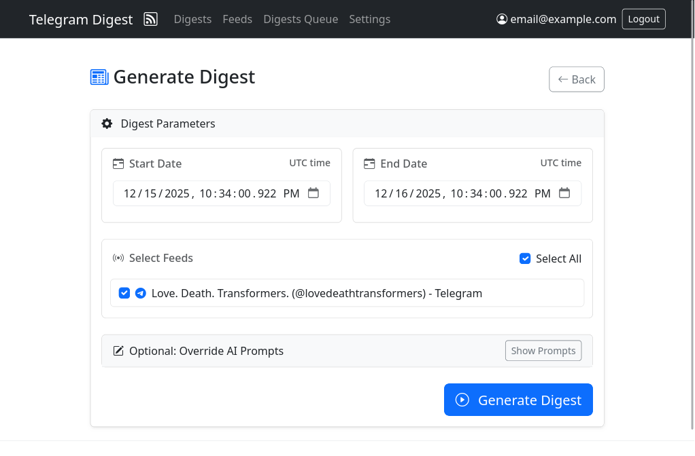
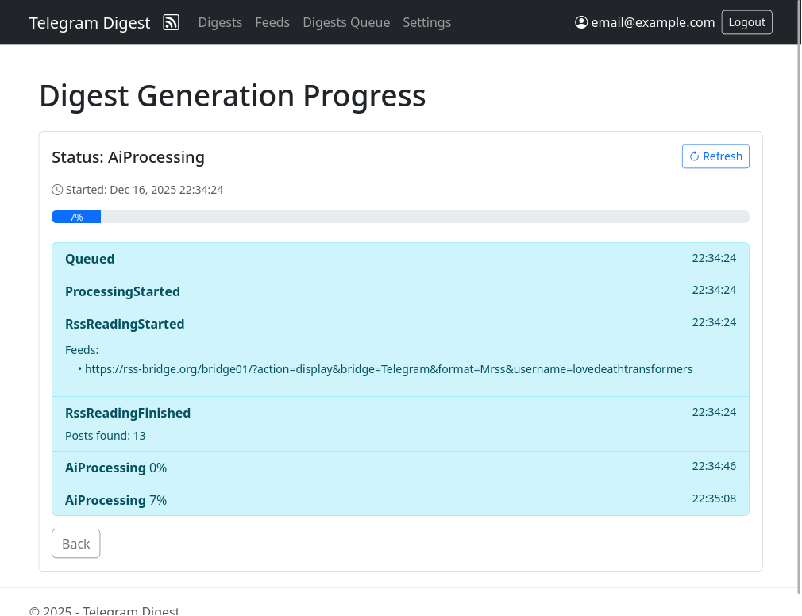
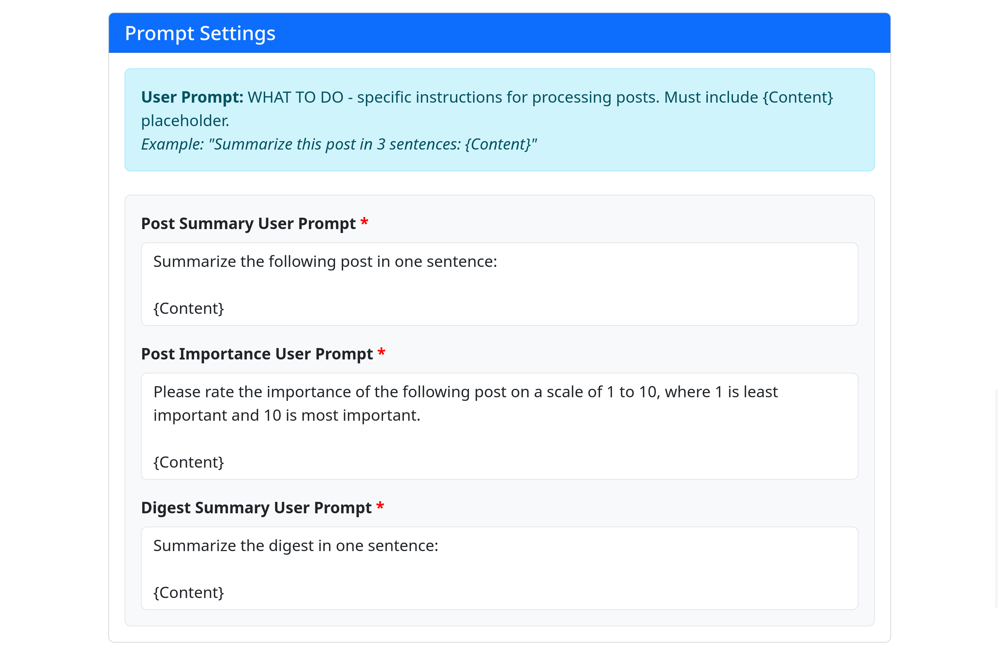
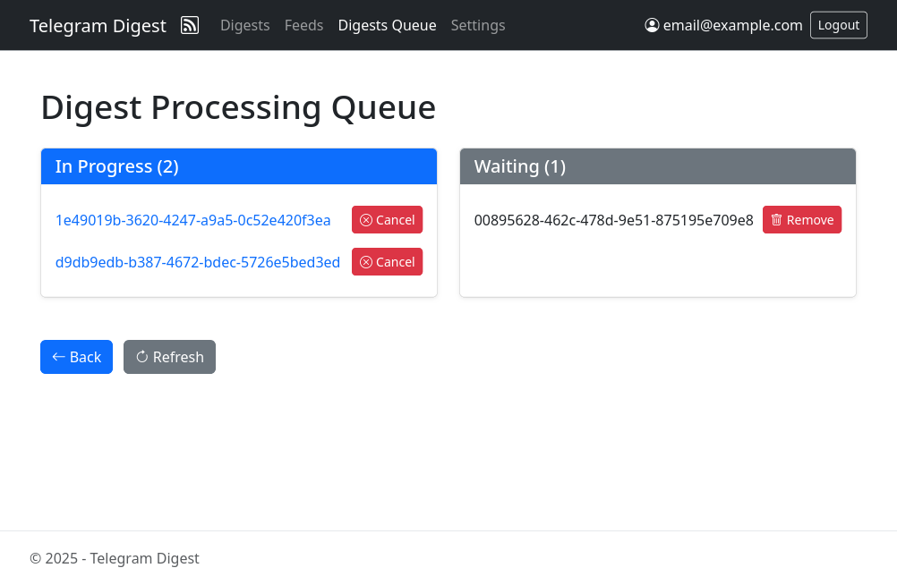

# RSSAIzer

## Features

- Simple web UI
  - View channels and digests
  - Links to sources
  - Monitor and control digest generation
  - Helpful and explicit internal error handling
- Summary generation
  - Summarize posts from channels
  - Evaluate post quality and importance
  - Customize evaluation and summarization via AI prompts
- Any RSS or public Telegram channel as a source
  - Fetches Telegram channel posts as RSS via third-party providers
  - Any RSS feed can be used as posts source
- Results in email and RSS
  - Receive digests over email
  - See generated digests as RSS feeds
- Management and deployment
  - Docker Compose ready

## Screenshots

<table>
  <tr>
    <td></td>
    <td></td>
  </tr>
  <tr>
    <td></td>
    <td></td>
  </tr>
  <tr>
    <td></td>
    <td></td>
  </tr>
</table>

## Usage

Project is in early alpha, breaking changes will occur. Please report discovered issues

### Prerequisites

- Docker and Docker Compose installed on your system
- Basic familiarity with command line operations

### Quick Start

1. Clone the repository:

   ```bash
   git clone TODO
   cd RSSAIzer
   ```

2. Set up environment configuration:

   ```bash
   cp .env.example .env
   ```

   Edit `.env` file with your configuration settings.

3. Start the project:

   ```bash
   docker compose up -d --build
   ```

4. Access the web interface at `http://localhost:5110`

5. To stop the application:
   ```bash
   docker compose down
   ```

### Configuration

Configuration is managed via environment variables in the `.env`.

Data is stored at `./RSSAIzer.Web/runtime` directory via docker volume.

### Maintenance

- View application logs:
  ```bash
  docker compose logs
  ```
- Restart the application:
  ```bash
  docker compose restart
  ```
- Update to latest version:
  ```bash
  docker compose pull
  docker compose up -d
  ```

### Development

1. Install dotnet 9 somehow (ask chatgpt)

2. For configuration use:

- `.env` for app level settings
- `appsettings.json` and `appsettings.json` in `RSSAIzer.Web/` for ASP.NET level settings
- `RSSAIzer.Web/Properties/launchSettings.json` for Visual Studio and Rider launch profiles

3. Restore and build app

   ```bash
   dotnet restore
   dotnet build
   ```

4. Start with hot reload

   ```bash
   dotnet watch run --project ./RSSAIzer.Web/RSSAIzer.Web.csproj
   ```

5. Run tests

   ```bash
   dotnet test
   ```

6. Format code (also auto applied on build)
   ```bash
   dotnet csharpier format .
   ```

## Current limitations

- Poor mobile experience
- No dark mode
- Single-user without password only
- can't handle any media, only text
- Bugs bugs bugs
